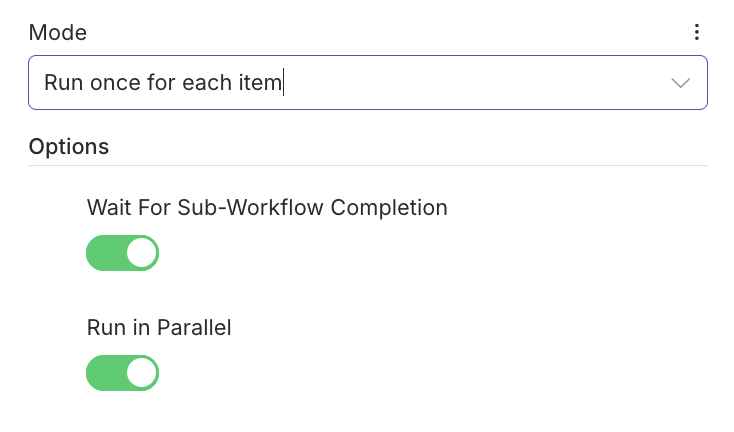

# n8n-nodes-execute-workflow-async

Custom n8n community node that mirrors the built-in **Execute Sub-workflow** node with additional option to execute sub-workflows in async mode gathering results at the end. In such case batching is recommended.

Usage



## Structure

- **nodes/ExecuteWorkflow/** — Node implementation
  - `ExecuteWorkflow.node.ts` — Base file (description + `execute()` stub)
  - `ExecuteWorkflow.node.json` — Codex metadata
- **package.json** — Package and n8n node registration
- **tsconfig.json** — TypeScript build config

## Development

```bash
npm install
npm run build
npm run dev   # run n8n with this node loaded
```

## Customization

The node currently has:

- **Source**: Database, Local File, Parameter, URL (parameters only; resolution not implemented)
- **Mode**: Run once with all items / Run once for each item
- **Option**: Wait for sub-workflow completion

`execute()` is a stub that returns the input items unchanged. Implement workflow resolution and execution here to match or diverge from the built-in Execute Workflow behavior.

## Adding an icon

Place `executeWorkflow.svg` in `nodes/ExecuteWorkflow/` (or adjust the `icon` path in the node description) so the node shows a custom icon in n8n.
